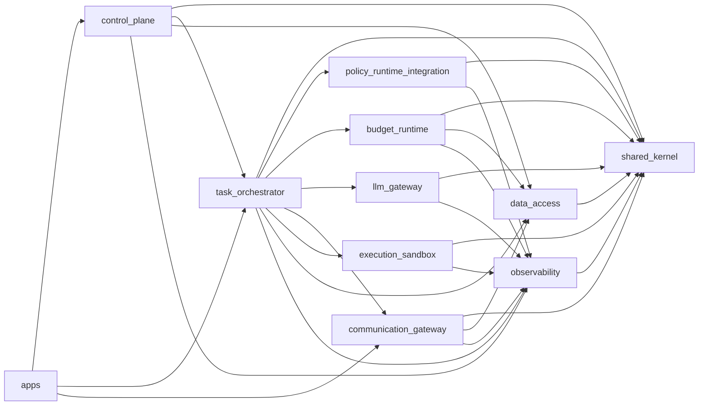

# OpenQilin v1 - Module Dependency Map

## 1. Scope
- Define the v1 runtime module map.
- Define allowed dependency directions and forbidden shortcuts.
- Keep the implementation modular without introducing premature service sprawl.

## 2. Major Modules
- `shared_kernel`
- `control_plane`
- `task_orchestrator`
- `policy_runtime_integration`
- `budget_runtime`
- `llm_gateway`
- `communication_gateway`
- `execution_sandbox`
- `data_access`
- `observability`

## 3. Dependency Direction Rules
Allowed high-level direction:
- `apps -> runtime modules`
- `runtime modules -> shared_kernel`
- `runtime modules -> data_access` only where persistence ownership requires it
- `runtime modules -> observability` for telemetry/audit emission only

Forbidden high-level direction:
- `shared_kernel -> feature modules`
- `control_plane -> sandbox/tool/provider direct execution`
- `communication_gateway -> task business state mutation`
- `execution_sandbox -> policy decision making`
- `llm_gateway -> task orchestration logic`

## 4. Module Responsibilities and Allowed Dependencies
### 4.1 `shared_kernel`
Responsibilities:
- ids, error envelopes, config primitives, common DTOs, tracing helpers

Allowed dependencies:
- standard library
- minimal cross-cutting libraries only

### 4.2 `control_plane`
Responsibilities:
- FastAPI routes, ingress validation, identity binding, query/mutation handlers

Allowed dependencies:
- `shared_kernel`
- `task_orchestrator`
- `data_access` for read-model/query contracts only
- `observability`

### 4.3 `task_orchestrator`
Responsibilities:
- task admission, state transitions, dispatch coordination, escalation hooks

Allowed dependencies:
- `shared_kernel`
- `policy_runtime_integration`
- `budget_runtime`
- `llm_gateway`
- `communication_gateway`
- `execution_sandbox`
- `data_access`
- `observability`

### 4.4 `policy_runtime_integration`
Responsibilities:
- policy request normalization, OPA client, fail-closed decision wrapper

Allowed dependencies:
- `shared_kernel`
- `observability`

### 4.5 `budget_runtime`
Responsibilities:
- reservation adapter, threshold-state evaluation, budget ledger integration

Allowed dependencies:
- `shared_kernel`
- `data_access`
- `observability`

### 4.6 `llm_gateway`
Responsibilities:
- model routing-profile resolution, provider adapter calls, fallback, usage normalization

Allowed dependencies:
- `shared_kernel`
- `observability`

### 4.7 `communication_gateway`
Responsibilities:
- A2A validation, ACP transport, retry/dead-letter handling, delivery outcomes

Allowed dependencies:
- `shared_kernel`
- `data_access`
- `observability`

### 4.8 `execution_sandbox`
Responsibilities:
- sandbox profile enforcement, tool invocation, artifact/output capture

Allowed dependencies:
- `shared_kernel`
- `observability`

### 4.9 `data_access`
Responsibilities:
- repositories, transactions, outbox writes, checkpoint store, migrations-facing persistence access

Allowed dependencies:
- `shared_kernel`

### 4.10 `observability`
Responsibilities:
- logs, traces, metrics, audit-event write boundary

Allowed dependencies:
- `shared_kernel`

## 5. Dependency Diagram

## 6. Enforcement Guidance
- cross-module imports should go through explicit public interfaces
- no deep imports into internal subpackages of another module
- persistence writes should stay with the owning module or `data_access`
- business logic must not be implemented in app entrypoints

## 7. Related Design Follow-Ups
- package tree location is defined in `RepoStructureAndPackageLayout-v1.md`
- per-module internal layout is defined in `design/v1/modules/`
