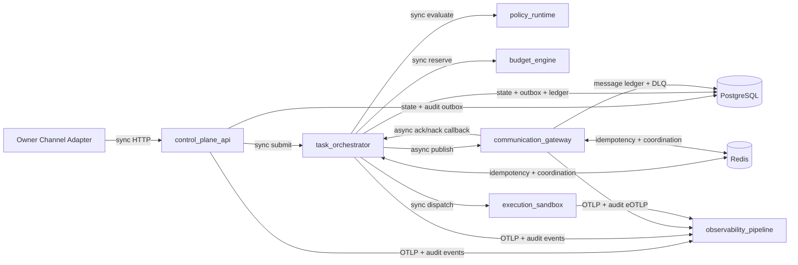

# ADR-0001: Runtime Boundary and Service Topology

## Status
Accepted (v1 design baseline, 2026-03-10)

## Context
- v1 implementation baseline is locked in `spec/architecture/ArchitectureBaseline-v1.md`.
- P0 requires explicit service boundaries for:
  - control plane
  - orchestrator worker
  - policy runtime
  - communication gateway
  - observability pipeline
- P0 also requires a locked sync vs async boundary to reduce implementation ambiguity.
- v1 constraints:
  - local-first deployment
  - governance-core first
  - simple operational model over maximal throughput

## Decision
### 1. Logical Service Topology (v1)
| Service | Runtime | Primary responsibilities | Inbound interface | Outbound dependencies |
| --- | --- | --- | --- | --- |
| `control_plane_api` | FastAPI | Owner/API ingress, identity binding, request validation, request idempotency pre-check, task submission | HTTP/JSON | `task_orchestrator`, `observability_pipeline`, PostgreSQL |
| `task_orchestrator` | LangGraph worker process | Task state machine, policy/budget/sandbox gate execution, obligation execution, lifecycle event production | Internal RPC/queue consumer | `policy_runtime`, `budget_engine` (logical component), `execution_sandbox`, `communication_gateway`, PostgreSQL, Redis, `observability_pipeline` |
| `policy_runtime` | OPA runtime | Deterministic policy decision, rule and obligation output | Internal HTTP/gRPC | Constitution policy bundle source |
| `communication_gateway` | A2A + ACP runtime | A2A envelope validation, ACP transport, ack/nack handling, retry and dead-letter handling | Internal publish/consume APIs | Redis (coordination), PostgreSQL (message ledger), `observability_pipeline` |
| `observability_pipeline` | OTel collector + audit sink | Trace/metric/log ingestion, immutable audit event sink, alert export | OTLP + append-only audit event API | Grafana stack, long-term log/audit storage |

Supporting v1 runtime dependencies:
- `postgresql`: source-of-record state + outbox/audit/message ledgers.
- `redis`: bounded idempotency and async coordination.
- `execution_sandbox`: isolated execution target for governed actions.
- `budget_engine`: logical component hosted in orchestrator boundary for v1 simplicity.

### 2. Sync vs Async Boundaries (locked for v1)
Synchronous boundaries:
- `owner_channel_adapter -> control_plane_api` (request/response)
- `control_plane_api -> task_orchestrator` (submit and initial admission result)
- `task_orchestrator -> policy_runtime` (policy decision gate)
- `task_orchestrator -> budget_engine` (reservation gate)
- `task_orchestrator -> execution_sandbox` (dispatch-acceptance gate)

Asynchronous boundaries:
- `task_orchestrator -> communication_gateway` command/event delivery and retries
- `communication_gateway -> task_orchestrator` ack/nack and delivery outcome callbacks
- `execution_sandbox -> task_orchestrator` runtime progress and completion events
- all components -> `observability_pipeline` telemetry export
- all governance-critical event writes use durable append-first semantics (outbox/audit ledger), then async export

### 3. Topology and Boundary Diagram

## Consequences
Positive:
- Clear implementation seams for P1 component design.
- Strong governance guarantees: state-changing actions cannot bypass policy/budget/sandbox gates.
- Bounded operational complexity for v1: budget engine remains a logical component instead of a separate network service.

Tradeoffs:
- Synchronous gate chain can increase tail latency.
- Communication and observability are eventually consistent after durable append.
- Additional storage structures (outbox/message ledger/dead-letter ledger) are required.

## Alternatives Considered
1. Single-process monolith with internal modules only.
- Rejected: weak fault isolation and unclear ownership boundaries for reliability behavior.

2. Fully async event-driven pipeline for all gates.
- Rejected for v1: operationally heavier and slower to stabilize during local-first rollout.

3. Externalized budget service as a separate network runtime in v1.
- Deferred: kept as a logical orchestrator component to keep v1 simple.

## Related `spec/` References
- `spec/architecture/ArchitectureBaseline-v1.md`
- `spec/infrastructure/architecture/RuntimeArchitecture.md`
- `spec/orchestration/control/TaskOrchestrator.md`
- `spec/constitution/PolicyEngineContract.md`
- `spec/constitution/BudgetEngineContract.md`
- `spec/orchestration/communication/AgentCommunicationA2A.md`
- `spec/orchestration/communication/AgentCommunicationACP.md`
- `spec/observability/AuditEvents.md`
- `spec/observability/AgentTracing.md`
