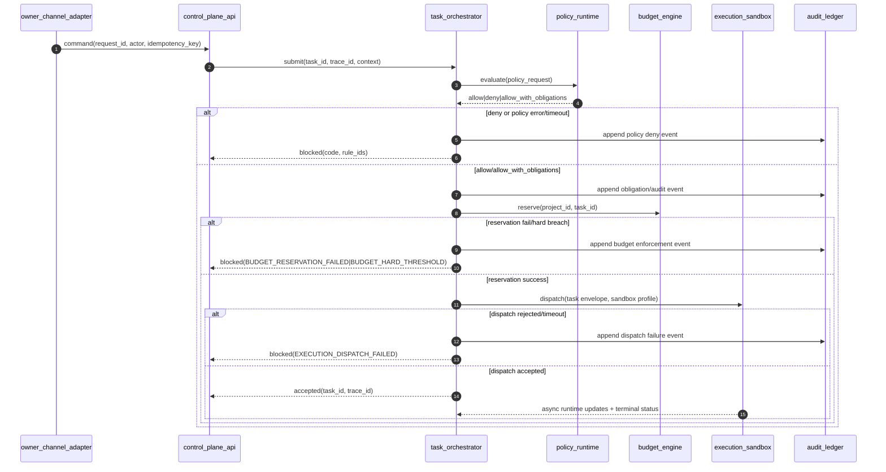

# ADR-0002: Policy and Orchestration Decision Path

## Status
Accepted (v1 design baseline, 2026-03-10)

## Context
- v1 requires a deterministic governance-core path:
  - `FastAPI -> Orchestrator -> OPA -> Budget -> Sandbox`
- Required from baseline/spec:
  - fail-closed policy posture
  - deterministic obligation execution
  - budget reservation before dispatch for costed actions
  - immutable audit/tracing correlation
- User preference for v1:
  - simple operational model
  - strict fail-closed for state-changing uncertainty

## Decision
### 1. Canonical Request/Response Path
1. `control_plane_api` receives owner command and validates envelope/identity/idempotency key.
2. `control_plane_api` submits task to `task_orchestrator` with `trace_id`.
3. `task_orchestrator` builds policy request context and calls `policy_runtime` (OPA).
4. If policy is `deny` or policy evaluation errors, task transitions to `blocked`.
5. If policy is `allow_with_obligations`, execute obligations in deterministic order:
   1. `emit_audit_event` (durable append required)
   2. `require_owner_approval` (when present)
   3. `reserve_budget` (when present)
   4. `enforce_sandbox_profile` (when present)
6. `task_orchestrator` performs budget reservation for all costed actions.
7. On reservation success, dispatch request to `execution_sandbox`.
8. Dispatch accepted:
   - task transitions to `dispatched`/`running`
   - API returns `accepted` with `task_id` and `trace_id` unless execution completed within sync window.
9. Terminal task outcomes are asynchronous updates (`completed|failed|cancelled|blocked`).

### 2. Timeout Strategy per Hop (v1 defaults)
| Hop | Timeout | Retry | Failure Code | Behavior |
| --- | --- | --- | --- | --- |
| `owner_channel_adapter -> control_plane_api` | `3s` | none | `DEPENDENCY_UNAVAILABLE` | caller sees timeout/error |
| `control_plane_api -> task_orchestrator submit` | `1.5s` | none | `DEPENDENCY_UNAVAILABLE` | fail request; no dispatch |
| `task_orchestrator -> policy_runtime evaluate` | `150ms` | none | `EVAL_INTERNAL_ERROR` or `POLICY_LOAD_ERROR` | fail-closed to `blocked` |
| `task_orchestrator -> budget_engine reserve` | `200ms` | none | `BUDGET_RESERVATION_FAILED` | fail-closed to `blocked` |
| `task_orchestrator -> execution_sandbox dispatch-accept` | `1s` | 1 retry with same idempotency key | `EXECUTION_DISPATCH_FAILED` | fail-closed to `blocked` if no accept |

Global synchronous response budget:
- `10s` max for API synchronous path.
- If no terminal completion inside `10s`, return `accepted` and continue async execution tracking.

### 3. Fail-Closed Rules (state-changing path)
Mandatory fail-closed:
- policy runtime unavailable/timeout/schema error
- budget reservation unavailable/timeout/error
- unknown role/authority mismatch/trust-level violation
- sandbox profile enforcement failure
- mandatory audit append failure (`emit_audit_event` durable write cannot be completed)

Fail-soft exceptions (read-only or non-governance side effects):
- telemetry exporter outage after durable append: execution may continue
- read-only query contracts may return explicit degraded/stale response with no mutation

### 4. Decision Path Diagram

## Consequences
Positive:
- Deterministic gate order and error handling reduce ambiguous runtime behavior.
- Fail-closed guarantees are explicit for all state-changing governance paths.
- Predictable timeout budgets enable SLO-driven implementation.

Tradeoffs:
- Tight policy and budget timeouts can reject operations under transient dependency pressure.
- A mandatory durable audit append before dispatch increases write-path dependency.
- Some flows return asynchronous acceptance rather than terminal outcome.

## Alternatives Considered
1. Retry policy and budget calls on timeout by default.
- Rejected: increases non-determinism and risk of duplicate side effects.

2. Allow sandbox dispatch when budget service is temporarily unavailable.
- Rejected: violates governance-first fail-closed model.

3. Make audit emission fully async and non-blocking for all events.
- Rejected for governed dispatch path: immutable append must exist before execution.

## Related `spec/` References
- `spec/infrastructure/architecture/RuntimeArchitecture.md`
- `spec/constitution/PolicyEngineContract.md`
- `spec/constitution/BudgetEngineContract.md`
- `spec/orchestration/control/TaskOrchestrator.md`
- `spec/cross-cutting/runtime/ErrorCodesAndHandling.md`
- `spec/observability/AuditEvents.md`
- `spec/observability/AgentTracing.md`
