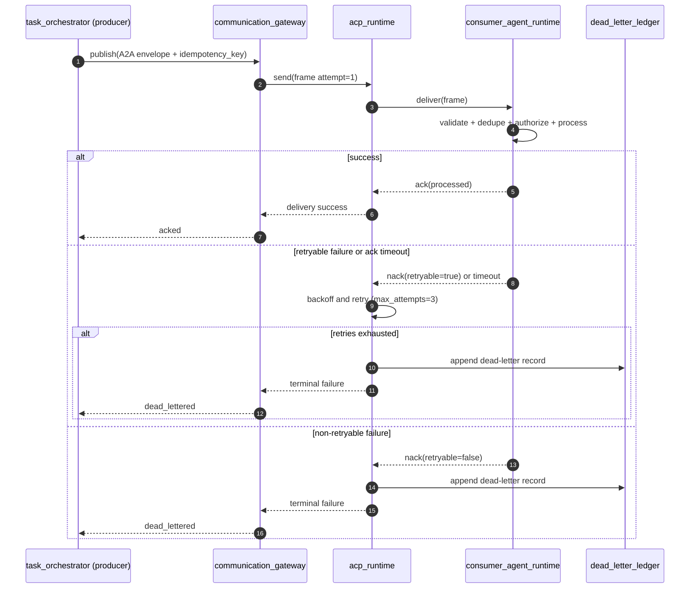

# ADR-0003: A2A + ACP Reliability Pipeline

## Status
Accepted (v1 design baseline, 2026-03-10)

## Context
- v1 requires reliable inter-agent communication with:
  - at-least-once delivery
  - bounded retry policy
  - deterministic dead-letter behavior
  - idempotent side-effect handling
- A2A defines the envelope and authority/policy metadata.
- ACP defines transport-level ack/nack/retry/dead-letter semantics.
- P0 requires ordering guarantees per channel type.

## Decision
### 1. Message Lifecycle (v1)
Producer-side states:
- `validated`
- `queued`
- `sent(attempt=n)`
- terminal: `acked` or `dead_lettered`

Consumer-side states:
- `received`
- `schema_validated`
- `dedupe_checked`
- `authorized`
- terminal: `processed` or `rejected`

Retry transitions:
- retry when `ack_timeout` or `retryable=true` nack
- dead-letter when:
  - non-retryable nack
  - attempts exceed `max_attempts=3`

### 2. Reliability Profile (locked)
- Delivery: `at-least-once`
- `ack_deadline_ms`: `30000`
- `max_attempts`: `3`
- Backoff schedule (bounded exponential with jitter):
  - `500ms`, `1s`, `2s`, `4s`, `8s` (cap `10s`)
- Dead-letter trigger:
  - non-retryable nack
  - retry exhaustion

### 3. Idempotency Handling
Mandatory rule:
- command/event messages without `idempotency_key` are rejected (`VALIDATION_FAILED`, non-retryable nack).

Deduplication strategy:
- Redis key: `a2a:idempotency:{channel_id}:{idempotency_key}`
- Operation: atomic set-if-absent on first seen message
- TTL: `72h` (v1 default window)
- On duplicate:
  - no side effects are re-executed
  - emit duplicate-consume metric
  - return `ack(processed)` if prior processing succeeded

Durable correlation:
- PostgreSQL message ledger stores:
  - `message_id`
  - `trace_id`
  - `idempotency_key`
  - final delivery status
  - attempt counters
  - terminal code

### 4. Ordering Guarantees by Channel Type
| Channel type | Ordering key | Guarantee |
| --- | --- | --- |
| `direct` | `conversation_id` | strict monotonic sequence per conversation |
| `group` | `conversation_id` | monotonic per conversation; no global cross-conversation order |
| `project` | `project_id:task_id` | monotonic per task stream; no global project order |
| `executive` | `channel_id` | strict monotonic sequence per executive channel |
| `governance` | `incident_id` (or dedicated governance stream id) | strict monotonic sequence per incident stream |

### 5. Dead-Letter Policy
Dead-letter record must include:
- original ACP frame
- embedded A2A envelope
- `trace_id`
- attempt count
- first/last failure timestamp
- terminal canonical error code
- retryability reason

Operational policy:
- dead-letter events are immutable and auditable.
- v1 redrive is manual governance action only.

### 6. Reliability Diagram

## Consequences
Positive:
- Communication reliability behavior is deterministic and aligned with existing contracts.
- At-least-once guarantee is safe due to enforced idempotency and deduplication.
- Per-channel ordering semantics are explicit and implementable.

Tradeoffs:
- Strict ordering per key can reduce parallelism.
- Redis + PostgreSQL dual-tracking introduces extra operational dependencies.
- Manual dead-letter redrive increases operator workload for persistent failures.

## Alternatives Considered
1. Exactly-once delivery as v1 baseline.
- Rejected: higher complexity and poor fit for v1 local-first simplicity.

2. Infinite retries instead of dead-letter.
- Rejected: risks unbounded resource consumption and hidden stuck work.

3. Best-effort delivery for non-critical channels.
- Rejected for v1: requirement is consistent at-least-once communication guarantee.

## Related `spec/` References
- `spec/orchestration/communication/AgentCommunicationA2A.md`
- `spec/orchestration/communication/AgentCommunicationACP.md`
- `spec/orchestration/control/TaskOrchestrator.md`
- `spec/cross-cutting/runtime/ErrorCodesAndHandling.md`
- `spec/observability/AuditEvents.md`
- `spec/observability/AgentTracing.md`
