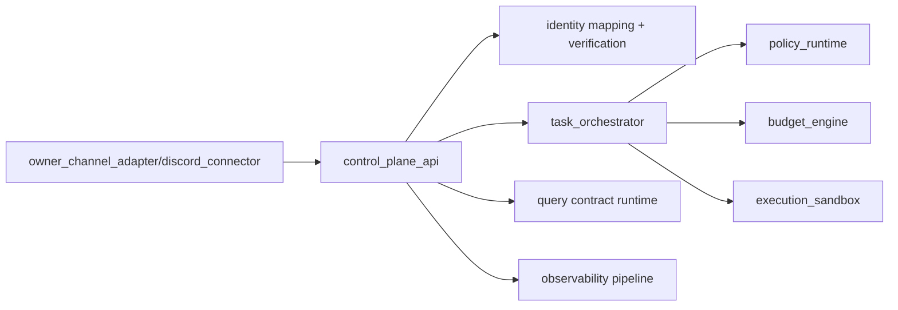
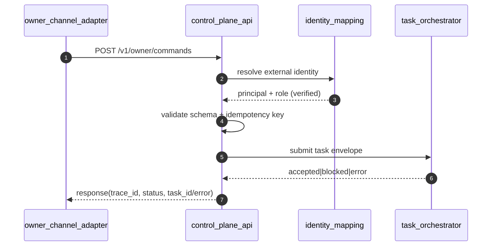

# OpenQilin v1 - Control Plane Component Design

## 1. Scope
- Define v1 control-plane component responsibilities and interfaces.
- Specify API surface for owner commands, project/task queries, and governance actions.
- Lock identity and authorization integration points at ingress.

Normative precedence:
1. `constitution/`
2. `spec/`
3. `design/`

## 2. Component Boundary
Component: `control_plane_api` (FastAPI)

Responsibilities:
- Accept and validate owner/system requests.
- Resolve external identity to internal principal.
- Enforce request-level idempotency pre-check.
- Route command requests to `task_orchestrator`.
- Serve governed query contracts.
- Trigger governance action requests through orchestrator-controlled paths.
- Emit telemetry/audit metadata for every critical path.

Non-responsibilities:
- Does not make policy decisions independently.
- Does not execute task logic.
- Does not bypass budget or sandbox gates.

## 3. Integration Topology

## 4. API Surface (v1)
Common request headers:
- `X-Request-Id`
- `X-Idempotency-Key` (required for command/governance mutation endpoints)
- `X-External-Channel` (for connector-originated requests)
- `X-External-Actor-Id` (for connector-originated requests)

Common response envelope fields:
- `trace_id`
- `status` (`ok|accepted|denied|error`)
- `policy_version` (when governed path applies)
- `policy_hash` (when governed path applies)
- `rule_ids` (when deny/obligation path applies)
- `data` or `error`

### 4.1 Owner Commands
| Method | Endpoint | Purpose | Synchronous result |
| --- | --- | --- | --- |
| `POST` | `/v1/owner/commands` | submit owner command envelope | `accepted` with `task_id` and `trace_id`, or `denied/error` |
| `POST` | `/v1/owner/discussions` | non-mutating discussion/info message ingress | `ok` |

Canonical owner ingress envelope for `POST /v1/owner/commands`:
- `message_id`
- `trace_id`
- `sender`
- `recipients`
- `message_type` (`command`)
- `priority`
- `timestamp`
- `content`
- optional `project_id`
- connector metadata:
  - `channel`
  - `external_message_id`
  - `actor_external_id`
  - `idempotency_key`
  - `raw_payload_hash`
- command resolution block:
  - `action`
  - `target`
  - `payload`

`POST /v1/owner/commands` response:
- `trace_id`
- `status` (`accepted|denied|error`)
- `policy_version`
- `policy_hash`
- `rule_ids`
- `data`:
  - `task_id`
  - `admission_state` (`queued|blocked`)
- `error` when applicable

### 4.2 Project/Task Query Contracts
| Method | Endpoint | Contract |
| --- | --- | --- |
| `GET` | `/v1/projects/{project_id}/snapshot` | `get_project_snapshot(project_id)` |
| `GET` | `/v1/milestones/{milestone_id}/plan` | `get_milestone_plan(milestone_id)` |
| `GET` | `/v1/tasks/{task_id}/brief` | `get_task_brief(task_id)` |
| `GET` | `/v1/tasks/{task_id}/runtime-context` | `get_task_runtime_context(task_id)` |
| `POST` | `/v1/projects/{project_id}/artifacts/search` | `search_project_artifacts(project_id, query, filters)` |

Query endpoint response contract:
- `trace_id`
- `contract_name`
- `status` (`ok|denied|error`)
- `policy_version`
- `policy_hash`
- `rule_ids`
- `data` or `error`

### 4.3 Governed Mutation Contracts
| Method | Endpoint | Contract |
| --- | --- | --- |
| `POST` | `/v1/tasks/{task_id}/notes` | `append_task_note(task_id, content_md, trace_id)` |
| `POST` | `/v1/artifacts` | `create_or_update_artifact(scope_type, scope_id, artifact_type, content_md, trace_id)` |
| `POST` | `/v1/tasks/{task_id}/state-transitions` | `request_task_state_transition(task_id, event, reason, trace_id)` |
| `POST` | `/v1/milestones/{milestone_id}/state-transitions` | `request_milestone_state_transition(milestone_id, event, reason, trace_id)` |

Mutation endpoint request requirements:
- request body must include canonical contract inputs from `ProjectTaskQueryContracts`
- `X-Idempotency-Key` is mandatory
- governed mutation response uses canonical response envelope plus mutation result reference

### 4.4 Governance Action Endpoints
| Method | Endpoint | Governance intent |
| --- | --- | --- |
| `POST` | `/v1/governance/projects/{project_id}/pause` | enforce project pause path |
| `POST` | `/v1/governance/projects/{project_id}/resume` | governed resume request |
| `POST` | `/v1/governance/agents/{agent_id}/pause` | agent containment path |
| `POST` | `/v1/governance/agents/{agent_id}/retire` | governed workforce lifecycle action |
| `POST` | `/v1/governance/escalations` | explicit escalation event creation |

Governance endpoints are mutation endpoints:
- require idempotency key
- require policy authorization through orchestrator
- require immutable audit event on critical actions

Governance action response:
- `trace_id`
- `status` (`accepted|denied|error`)
- `policy_version`
- `policy_hash`
- `rule_ids`
- `data`:
  - `governance_action_id`
  - `task_id` or `event_id`
  - `admission_state`
- `error` when applicable

## 5. Identity and Authorization Integration
### 5.1 Identity Resolution
Ingress identity steps:
1. Validate connector authenticity/signature.
2. Resolve external tuple (`channel`, `actor_external_id`, `guild/channel id`) to internal principal.
3. Verify mapping state is `verified` and principal is active.
4. Bind canonical actor envelope (`principal_id`, `role`, `trust_domain`) to request context.

Fail-closed behavior:
- unknown/revoked/pending mapping -> deny before orchestration.
- connector validation failure -> deny before orchestration.

### 5.2 Authorization Gate Integration
- `control_plane_api` performs preflight validation only.
- authoritative authorization remains `policy_runtime` via `task_orchestrator`.
- query and mutation contracts both execute with role and project-scope checks.
- cross-project calls deny unless explicit policy authorization exists.

## 6. Request Lifecycle (Command Path)

Timeout budget alignment:
- API ingress validation + mapping: `<= 500ms`
- API->orchestrator submit: `<= 1.5s`
- full synchronous path budget: `<= 10s`, then return `accepted` if still in async execution

## 7. Idempotency and Retry Behavior
- Command and governance mutation endpoints require `X-Idempotency-Key`.
- Duplicate key with same payload returns previous terminal/admission result.
- Duplicate key with different payload returns `validation_error`.
- API does not retry non-idempotent downstream operations automatically.
- Client/connector retries are supported only with same idempotency key.

## 8. Failure Modes and Handling
| Failure mode | Detection point | Response | Retryable |
| --- | --- | --- | --- |
| invalid request envelope | API validation | `validation_error` | false |
| unknown/revoked external identity | identity mapping | `authorization_error` | false |
| policy deny | orchestrator response | `authorization_error` | false |
| policy engine unavailable/timeout | orchestrator response | fail-closed deny | false |
| budget reservation failure/hard breach | orchestrator response | `budget_error` deny | false |
| sandbox dispatch timeout/reject | orchestrator response | `runtime_error` deny | limited (orchestrator-governed) |
| telemetry exporter outage | observability export | log and continue if durable append already succeeded | true |

Canonical error mapping:
- schema/required-field failures -> `validation_error`
- identity/policy denies -> `authorization_error`
- budget reservation/hard threshold -> `budget_error`
- downstream unavailability/dispatch timeout -> `runtime_error`

## 9. Component Conformance Criteria
- Every command is attributable to authenticated principal (`IAM-001`).
- No command execution without policy gate (`RT-001`, `OIM-001`).
- High-impact interaction paths emit immutable audit events (`OIM-002`, `AUD-001`).
- Query/mutation contracts enforce role and project scope checks.
- All governed responses include trace and policy metadata.

## 10. Related `spec/` References
- `spec/architecture/ArchitectureBaseline-v1.md`
- `spec/infrastructure/architecture/RuntimeArchitecture.md`
- `spec/orchestration/communication/OwnerInteractionModel.md`
- `spec/cross-cutting/security/IdentityAndAccessModel.md`
- `spec/cross-cutting/security/DiscordOwnerChannelIdentityHardening.md`
- `spec/cross-cutting/contracts/ProjectTaskQueryContracts.md`
- `spec/orchestration/control/TaskOrchestrator.md`
- `spec/cross-cutting/runtime/ErrorCodesAndHandling.md`
- `spec/governance/architecture/DecisionReviewGates.md`
- `spec/governance/architecture/EscalationModel.md`
