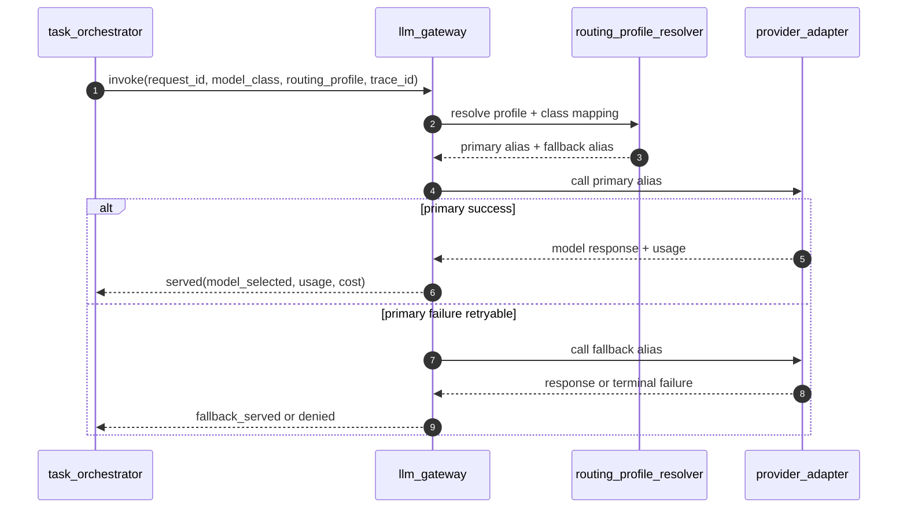

# OpenQilin v1 - LLM Gateway Component Design

## 1. Scope
- Define v1 `llm_gateway` runtime design.
- Define model routing and fallback behavior by profile.
- Lock initial testing posture to free-tier Gemini profile in local/CI.

## 2. Component Boundary
Component: `llm_gateway` (LiteLLM-backed boundary)

Responsibilities:
- Accept governed model requests from orchestrator/runtime components.
- Resolve `model_class` using `routing_profile`.
- Enforce bounded fallback and retry behavior.
- Attach usage/cost metadata to every completed request.
- Emit trace/audit metadata for route and fallback decisions.

Non-responsibilities:
- Does not authorize actions (policy decision remains external).
- Does not bypass budget-policy semantics.
- Does not allow direct provider access from orchestrator/agents.

## 3. Input/Output Contract
### 3.1 Request
Minimum request fields:
- `request_id`
- `trace_id`
- `project_id`
- `agent_id`
- `model_class`
- `routing_profile`
- `messages_or_prompt`
- `max_tokens`
- `temperature`
- `budget_context`
- `policy_context`

### 3.2 Response
Minimum response fields:
- `request_id`
- `trace_id`
- `decision` (`served|fallback_served|denied`)
- `model_selected` (provider alias + resolved model identifier)
- `usage`
- `estimated_cost`
- `latency_ms`
- `policy_context`
- `route_metadata` (`routing_profile`, `fallback_hops`, `route_reason`)

## 4. Routing Profile Integration
Routing authority:
- `spec/infrastructure/architecture/LlmModelRoutingProfile-v1.md`

v1 active defaults:
- `local_dev`: `dev_gemini_free`
- `ci`: `dev_gemini_free`
- `staging|production`: `prod_controlled`

`dev_gemini_free` behavior:
- uses Gemini free-tier provider aliases for `interactive_fast` and `reasoning_general`
- bounded fallback (`max_fallback_hops=1`)
- request controls tuned for initial testing cost posture

## 5. Runtime Flow

## 6. Timeout and Failure Model
v1 defaults:
- gateway internal route resolution timeout: `100ms`
- provider call timeout: `2s` (profile-tunable)
- max fallback hops: profile-defined (`1` for `dev_gemini_free`)

Fail-closed cases:
- unknown/inactive routing profile
- unknown model class for active profile
- unresolved provider alias
- governed request without required policy/budget context

Failure code alignment:
- use canonical runtime codes from `ErrorCodesAndHandling` with deterministic `retryable` value.

## 7. Observability Requirements
- Required spans:
  - `llm_gateway_route_resolve`
  - `llm_gateway_provider_call`
  - `llm_gateway_fallback`
- Required structured fields:
  - `trace_id`, `request_id`, `routing_profile`, `model_class`, `model_selected`, `fallback_hops`, `estimated_cost`
- Required events:
  - route_selected
  - fallback_triggered
  - request_denied
  - provider_failure_terminal

## 8. Security and Access
- Provider credentials only via secret references.
- Direct provider egress from non-gateway runtime components is blocked.
- Request payload redaction policy applies before log export.

## 9. Component Conformance Criteria
- All governed model calls route through gateway boundary.
- Local/CI default profile is `dev_gemini_free`.
- Unknown profile/class requests are denied fail-closed.
- Fallback events are trace-correlated and auditable.
- Usage/cost metadata is present for all served responses.

## 10. Related `spec/` References
- `spec/infrastructure/architecture/LlmGatewayContract.md`
- `spec/infrastructure/architecture/LlmModelRoutingProfile-v1.md`
- `spec/constitution/BudgetEngineContract.md`
- `spec/cross-cutting/runtime/ErrorCodesAndHandling.md`
- `spec/observability/AgentTracing.md`
- `spec/observability/AuditEvents.md`
- `spec/architecture/ArchitectureBaseline-v1.md`
