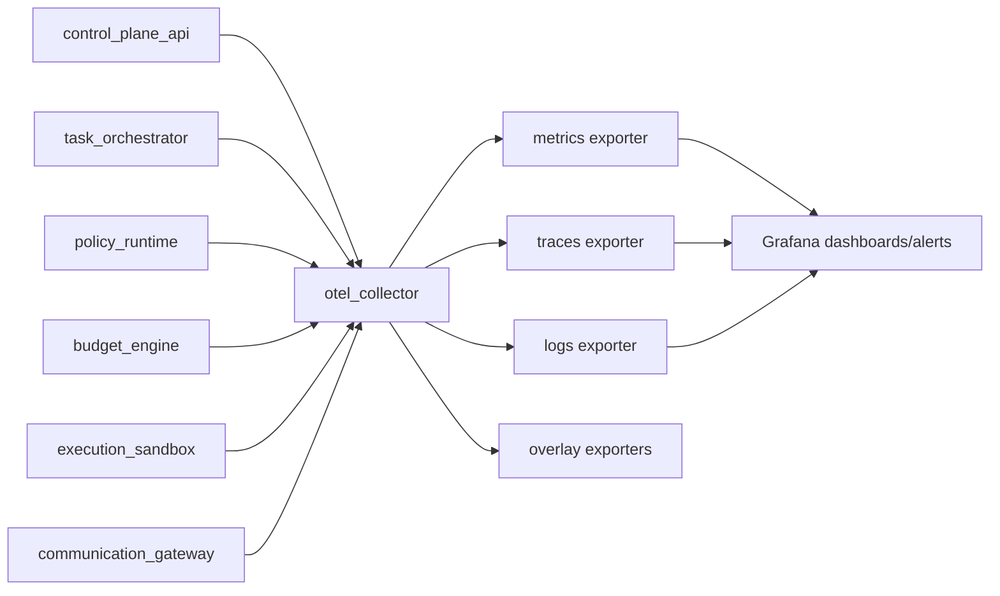

# OpenQilin v1 - Observability Component Design

## 1. Scope
- Define v1 observability component architecture.
- Specify OpenTelemetry collector pipelines and exporters.
- Define telemetry correlation model and Grafana minimum dashboard/alert set.

v1 stack posture:
- baseline: OpenTelemetry + Grafana
- overlays: LangSmith + AgentOps

## 2. Component Boundary
Component: `observability_pipeline`

Responsibilities:
- Ingest telemetry signals from runtime components.
- Validate required governance telemetry fields.
- Route metrics/logs/traces to Grafana-compatible backends.
- Persist immutable audit events through append-only sink.
- Trigger alert routing for critical incidents.

Non-responsibilities:
- Does not authorize runtime actions.
- Does not mutate runtime business state.

## 3. OTel Collector Pipeline Design
### 3.1 Signal Sources
- `control_plane_api`
- `task_orchestrator`
- `policy_runtime`
- `budget_engine`
- `execution_sandbox`
- `communication_gateway`

Transport:
- OTLP gRPC/HTTP for traces/metrics/logs
- append-only audit event API for governance-critical audit records

### 3.2 Collector Processing Stages
| Stage | Purpose |
| --- | --- |
| `receiver:otlp` | receive telemetry from all components |
| `processor:memory_limiter` | collector backpressure protection |
| `processor:resource` | normalize service/component attributes |
| `processor:attributes` | enforce required correlation metadata fields |
| `processor:batch` | export efficiency and stability |
| `processor:tail_sampling` | force-sample deny/governance/budget incidents |

### 3.3 Exporters
| Signal | Export target | v1 usage |
| --- | --- | --- |
| metrics | Prometheus-compatible endpoint | Grafana dashboards and alerts |
| traces | Tempo (OTLP) | distributed trace analysis |
| logs | Loki | structured operational and governance logs |
| audit events | PostgreSQL immutable ledger + log mirror | compliance/audit source of truth |

Overlay exports:
- LangSmith receives LLM/agent traces keyed by `trace_id`.
- AgentOps receives operational/cost analytics keyed by runtime correlation ids.

## 4. Correlation Model
Required correlation fields for governed events:
- `trace_id`
- `event_id`
- `project_id` (when applicable)
- `task_id` (when applicable)
- `agent_id` (when applicable)
- `actor_role`
- `policy_version`
- `policy_hash`
- `rule_ids`
- `component`
- `severity`

Span boundary expectations:
- `owner_ingress`
- `policy_evaluation`
- `task_orchestration`
- `budget_reservation`
- `execution_sandbox`
- `a2a_emit` / `a2a_consume`
- `acp_send` / `acp_ack_or_nack`
- `audit_emit`

Correlation rules:
- retries keep same `trace_id`, new child retry span each attempt.
- deny/budget-hard/safety incidents are always sampled.
- sensitive fields are redacted before export.

## 5. Grafana Minimum Dashboard Set (v1)
### 5.1 Dashboard Catalog
| Dashboard | Core panels | Primary owner |
| --- | --- | --- |
| `Governance Gate Health` | policy deny rate, policy eval errors, obligation failures | auditor |
| `Task Orchestration Health` | task throughput, blocked rate, failure rate, dispatch latency | cwo |
| `Communication Reliability` | ack timeout rate, retry count, dead-letter rate | administrator |
| `Budget and Escalation` | soft/hard breach counts, containment latency, escalation volume | auditor |
| `Runtime Platform` | component availability, OTEL ingest lag, error budget burn | administrator |

### 5.2 Minimum Alert Set
| Alert | Trigger (v1 baseline) | Route |
| --- | --- | --- |
| `policy_eval_error_spike` | policy evaluation error rate > 2% for 5m | auditor -> owner |
| `budget_hard_breach_detected` | any hard breach event | auditor -> owner, notify ceo |
| `safety_critical_incident` | any critical safety incident | auditor -> owner |
| `orchestration_deadlock` | no progress on queued/running tasks > 10m | project_manager -> cwo -> ceo |
| `acp_dead_letter_spike` | dead-letter rate > 1% for 10m | administrator -> cwo -> ceo |
| `collector_ingest_failure` | OTEL ingest/export failures sustained 5m | administrator -> owner |

Alert payload minimum:
- `event_id`
- `trace_id`
- `alert_type`
- `severity`
- `source_owner_role`
- `next_owner_role`
- `rule_ids`
- `timestamp`

## 6. Logging and Audit Profiles
- Compact profile for normal `allow` paths.
- Full profile for `deny`, `allow_with_obligations`, governance/emergency, and critical incidents.
- Governed logs carry `policy_version`, `policy_hash`, and `rule_ids`.
- Audit records are immutable and append-only.

## 7. Failure Modes and Operational Handling
| Failure mode | Handling |
| --- | --- |
| collector exporter outage | retry export; buffer within limits; preserve local diagnostics |
| trace backend unavailable | continue metrics/logs and queue retry for traces |
| log backend unavailable | continue metrics/traces; persist local structured fallback buffer |
| audit sink unavailable | fail closed for governance-critical action paths requiring durable audit append |
| high-cardinality field explosion | drop/normalize offending labels and emit governance warning event |

## 8. Component Conformance Criteria
- Policy, lifecycle, and budget crossings always emit telemetry (`OBS-001..003`).
- Critical incidents always generate alert routing (`OBS-004`, `MET-001`).
- Every alert resolves source owner role or defaults to `ceo` with audit metadata (`MET-003`).
- Governed logs satisfy full-profile requirements where mandated (`LOG-002`, `LOG-003`).

## 9. Related `spec/` References
- `spec/observability/ObservabilityArchitecture.md`
- `spec/observability/MetricsAndAlerts.md`
- `spec/observability/SystemLogs.md`
- `spec/observability/AgentTracing.md`
- `spec/observability/AuditEvents.md`
- `spec/cross-cutting/runtime/ErrorCodesAndHandling.md`
- `spec/governance/architecture/EscalationModel.md`
- `spec/orchestration/control/TaskOrchestrator.md`
