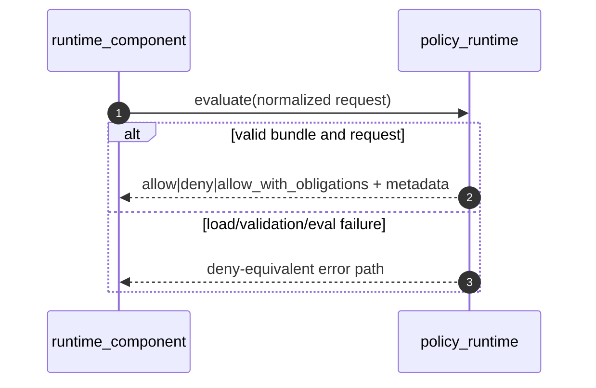

# OpenQilin v1 - Policy Runtime Integration Design

## 1. Scope
- Define the integration boundary between runtime components and `policy_runtime`.
- Specify request normalization, bundle/version handling, and fail-closed behavior.

## 2. Component Boundary
Component: `policy_runtime` (OPA + constitution bundle)

Responsibilities:
- evaluate normalized policy requests deterministically
- return allow/deny/obligation decisions with version/hash metadata
- fail closed on load, validation, or evaluation error

Integration responsibilities of callers:
- normalize actor, target, capability, and communication context
- pass only canonical enum values
- treat all policy errors as deny

## 3. Request Normalization
Callers must supply:
- `request_id`
- `trace_id`
- canonical `actor`
- `action`
- `target`
- `context.project_id`
- `context.budget_state`
- `context.requested_capabilities`
- `context.execution_target`
- `context.communication_context` when applicable

Normalization rules:
- unknown roles are denied before or by policy
- missing required context for governed action is invalid
- caller must preserve exact policy version/hash from response

## 4. Bundle and Version Handling
- active constitution bundle is loaded from `PolicyManifest`
- only one active version is authoritative at runtime
- every decision is recorded with `policy_version` and `policy_hash`
- bundle load/refresh failure denies governed actions

## 5. Runtime Interaction

## 6. Failure and Timeout
- evaluation timeout target: `150ms`
- no automatic retry on evaluation timeout
- canonical fail-closed conditions:
  - bundle unavailable
  - malformed request
  - evaluation runtime error

## 7. Observability
- required span: `policy_evaluation`
- required decision event fields:
  - `trace_id`, `request_id`, `decision`, `rule_ids`, `policy_version`, `policy_hash`
- denied and obligation-bearing decisions are force-sampled

## 8. Related `spec/` References
- `spec/constitution/PolicyEngineContract.md`
- `spec/constitution/ConstitutionBindingModel.md`
- `spec/infrastructure/architecture/RuntimeArchitecture.md`
- `spec/cross-cutting/runtime/ErrorCodesAndHandling.md`
- `spec/observability/AuditEvents.md`
