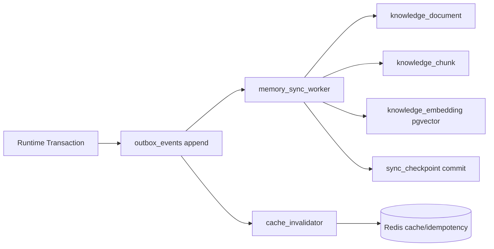

# OpenQilin v1 - Data and Memory Component Design

## 1. Scope
- Define PostgreSQL schema package boundaries for v1 runtime data.
- Define Redis strategy for cache/idempotency/coordination.
- Define pgvector retrieval design and relational CDC/event flow.

Design principles:
- PostgreSQL is source of record.
- pgvector is a derived retrieval index.
- Redis is bounded to ephemeral cache/idempotency/coordination.
- All governed data paths preserve trace and policy metadata.

## 2. PostgreSQL Schema Package Boundaries
v1 uses logical package boundaries (single DB, multiple schema namespaces).

### 2.1 Package Overview
| Package | Purpose | Canonical entities |
| --- | --- | --- |
| `runtime_state` | Project/milestone/task source-of-record state | `project_container`, `milestone`, `task`, `task_assignment`, `task_requirement`, `dimension_project_state`, `dimension_milestone_state`, `dimension_task_state` |
| `registry` | Identity/agent/tool/memory lookup surfaces | `agent_registry`, `lookup_roles`, `lookup_memory_levels`, `dimension_agent_state`, `dimension_tools` |
| `artifacts` | Narrative artifacts and versioning | `project_artifact`, `project_artifact_version` |
| `knowledge` | Ingested docs, chunking, vector embeddings | `knowledge_document`, `knowledge_chunk`, `knowledge_embedding` |
| `communication` | A2A/ACP message ledger and delivery outcomes | `messages` (+ v1 support tables `message_delivery_attempt`, `message_dead_letter`) |
| `observability_data` | Immutable logs/metrics and event propagation | `execution_logs`, `metrics_store`, `outbox_events`, `sync_checkpoint` |
| `governance_data` | Policy/budget/escalation decision ledger | v1 support tables `policy_decision_ledger`, `budget_reservation_ledger`, `escalation_event_ledger` |

Support table notes:
- support tables are implementation tables needed to enforce reliability/audit semantics from spec contracts.
- they do not replace canonical envelopes in `spec/`.

### 2.2 Boundary Rules
- Mutating lifecycle state is restricted to `runtime_state`.
- `artifacts` and `knowledge` do not directly mutate protected lifecycle fields.
- `communication` writes are append-first with immutable terminal delivery status.
- `execution_logs` are append-only and checksum-verifiable.
- Cross-package writes in one unit of work require single transaction or outbox choreography.

## 3. Data Access Contracts
- All runtime reads/writes must pass contract layer in control plane/orchestrator.
- No ad-hoc SQL path from runtime agents.
- Sensitive reads/writes include audit emission with trace and policy metadata.
- Idempotent mutation contracts must persist request idempotency context.

## 4. Redis Strategy (v1)
Redis is non-authoritative and rebuildable from PostgreSQL where applicable.

### 4.1 Keyspace Plan
| Key pattern | Purpose | TTL |
| --- | --- | --- |
| `idmp:api:{principal_id}:{idempotency_key}` | owner command/mutation dedupe | `72h` |
| `idmp:a2a:{channel_id}:{idempotency_key}` | A2A message dedupe | `72h` |
| `cache:project_snapshot:{project_id}` | short-lived query cache | `30s` |
| `cache:task_runtime:{task_id}` | short-lived task context cache | `30s` |
| `coord:dispatch:{task_id}` | in-flight dispatch coordination marker | `15m` |
| `coord:cdc:{consumer_name}:heartbeat` | CDC consumer liveness | `120s` |

### 4.2 Redis Usage Rules
- `SETNX` + TTL for idempotency keys.
- Cache entries are best-effort and safely discardable.
- Redis loss must not lose source-of-record data or violate governance correctness.
- On Redis recovery, rehydrate only ephemeral caches/markers.

## 5. pgvector Retrieval Path Design
### 5.1 Write Path
1. Artifact write committed in `artifacts.project_artifact_version`.
2. Outbox event appended to `observability_data.outbox_events`.
3. Ingestion/extraction worker materializes `knowledge_document` and `knowledge_chunk`.
4. Embedding generation writes vector rows to `knowledge_embedding` (pgvector).
5. `sync_checkpoint` advances only after successful derived write.

### 5.2 Read Path
1. Query contract authorizes scope (`project_id`, role, trust context).
2. Retrieval service embeds query text via governed LLM gateway path.
3. Execute filtered vector search in `knowledge_embedding`:
   - scope filter by `project_id`
   - optional scope type filter (`project|milestone|task`)
   - top-k nearest neighbors
4. Join chunk/document metadata and return references.
5. Emit trace spans and retrieval diagnostics.

### 5.3 Retrieval Guardrails
- Cross-project retrieval denied by default.
- Missing or stale embeddings degrade gracefully to metadata-only artifact search.
- Vector index is rebuildable from source tables and extraction metadata.

## 6. CDC and Event Flow Design
Event source:
- transactional outbox in `observability_data.outbox_events`

Consumer groups:
- `memory_sync_worker` -> `knowledge.*`
- `cache_invalidator` -> Redis invalidation
- `observability_router` -> telemetry projection

Delivery model:
- at-least-once consumption with idempotent apply by `event_id`
- ordered processing by monotonic sequence/id
- checkpointed progress in `observability_data.sync_checkpoint`

Failure behavior:
- transient consumer failure: bounded retry with backoff.
- repeated failure: pause consumer and escalate to `administrator`.
- checkpoint corruption: recover from last valid checkpoint and replay.

## 7. Consistency and Recovery Model
- Source-of-record consistency: strong consistency inside PostgreSQL transaction boundaries.
- Derived layers (`knowledge`, Redis caches): eventual consistency.
- Recovery priority:
  1. restore PostgreSQL
  2. validate core table integrity
  3. rebuild derived indexes/caches via replay/backfill playbooks

## 8. Migration and Versioning Rules
- Schema changes are forward-only migrations.
- Every table carries explicit schema/version metadata where required by event contracts.
- Breaking changes to extraction schema require extractor version bump and replay plan.
- Retention transitions follow hot/warm/cold lifecycle and snapshot-before-compression.

## 9. Component Conformance Criteria
- `SCHEMA-001..005` enforced for core entities/events.
- `MEM-006` and `MEM-007` enforced for CDC idempotency and checkpoint recovery.
- `STR-002..005` enforced for retention and isolation.
- Duplicate ingest/replay does not duplicate derived writes.
- Cross-project data access without policy authorization is denied.

## 10. Related `spec/` References
- `spec/infrastructure/architecture/DataModelAndSchemas.md`
- `spec/orchestration/memory/AgentMemoryModel.md`
- `spec/orchestration/memory/ProjectArtifactModel.md`
- `spec/infrastructure/data/ArtifactIngestionAndExtraction.md`
- `spec/infrastructure/data/StorageAndRetention.md`
- `spec/infrastructure/operations/DataMemoryOperationsPlaybooks.md`
- `spec/state-machines/MemoryStateMachine.md`
- `spec/cross-cutting/contracts/ProjectTaskQueryContracts.md`
- `spec/orchestration/communication/AgentCommunicationA2A.md`
- `spec/orchestration/communication/AgentCommunicationACP.md`
