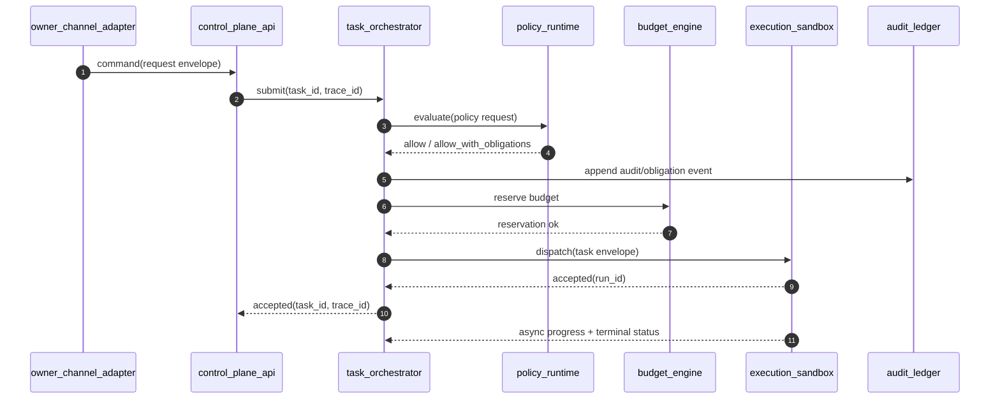

# SEQ-0001: Owner Command -> Policy -> Budget -> Sandbox

## Actors
- `owner_channel_adapter`
- `control_plane_api`
- `task_orchestrator`
- `policy_runtime`
- `budget_engine`
- `execution_sandbox`
- `audit_ledger`

## Preconditions
- Active policy version and hash are available.
- Request has valid actor identity and idempotency key.
- Project/task scope is resolvable.

## Normal Path

## Failure Branches
- Policy deny or policy error: transition task to `blocked`, append deny audit event, return denial code.
- Budget reservation failure/hard threshold: transition to `blocked`, append enforcement event.
- Sandbox dispatch reject/timeout: transition to `blocked`, append dispatch-failure event.

## Expected Outputs
- Task state transitions in source-of-record.
- Immutable audit events with policy metadata.
- Trace continuity across all hops.
