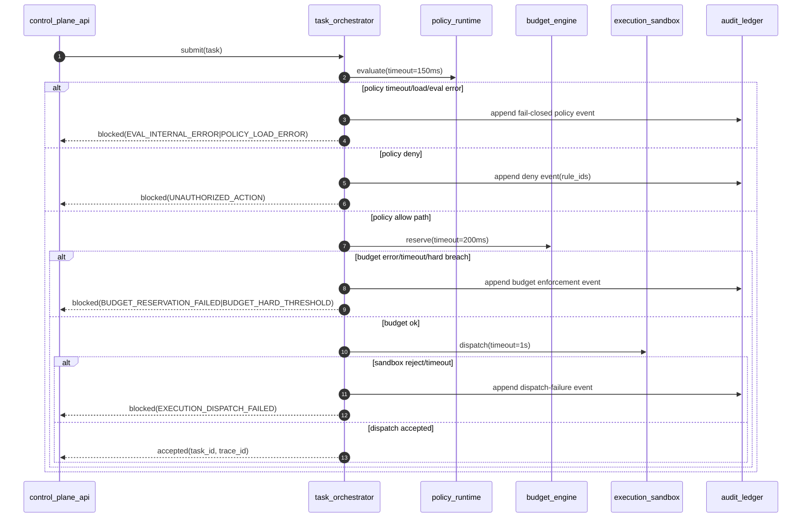

# SEQ-0002: Fail-Closed and Timeout Branches

## Actors
- `control_plane_api`
- `task_orchestrator`
- `policy_runtime`
- `budget_engine`
- `execution_sandbox`
- `audit_ledger`

## Preconditions
- Task request passed API envelope validation.
- `trace_id` is established and propagated.

## Sequence

## Notes
- State-changing governed actions are fail-closed when uncertainty exists.
- Export failures after durable audit append are non-blocking.
- Read-only query flows may return degraded responses with no state mutation.
