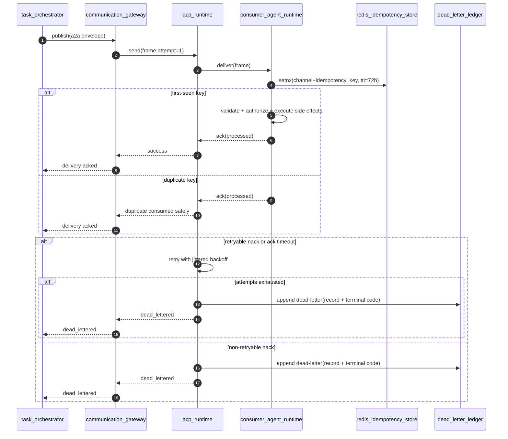

# SEQ-0003: A2A + ACP Reliability Lifecycle

## Actors
- `task_orchestrator` (producer)
- `communication_gateway`
- `acp_runtime`
- `consumer_agent_runtime`
- `redis_idempotency_store`
- `dead_letter_ledger`

## Preconditions
- Message envelope includes:
  - `message_id`
  - `trace_id`
  - `idempotency_key`
  - policy and authority metadata
- Reliability profile v1 is active (`ack_deadline_ms=30000`, `max_attempts=3`).

## Sequence

## Failure Branches
- Missing `idempotency_key`: non-retryable nack (`VALIDATION_FAILED`) -> dead-letter.
- Non-retryable authorization or schema failure: immediate dead-letter.
- Retryable transport failures: bounded retry then dead-letter on exhaustion.

## Expected Outputs
- Deterministic delivery outcomes (`acked` or `dead_lettered`).
- Immutable dead-letter records with trace and terminal error metadata.
- No duplicate side effects for duplicate deliveries.
