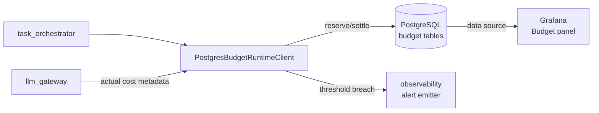

# OpenQilin v2 — Budget Runtime Component Delta

Extends `design/v1/components/PolicyRuntimeIntegrationDesign-v1.md` (budget sections). Only changes are documented here.

## 1. Changes in v2

### 1.1 Replace integer counter with PostgreSQL-backed budget ledger

**Current (v1):** `InMemoryBudgetRuntimeClient` uses `_remaining_units: int = 10_000`. Resets on restart. Cost is `10 + len(args)*2 + min(len(command), 24)` (character count). Violates BUD-002 (no atomicity).

**v2 target:** `PostgresBudgetRuntimeClient` backed by a budget ledger in PostgreSQL.

New tables:
```sql
-- Budget allocation per project (set by owner/ceo)
CREATE TABLE budget_allocations (
    id UUID PRIMARY KEY,
    project_id UUID REFERENCES projects(id),
    currency_limit_usd NUMERIC(12, 6),
    quota_limit_tokens BIGINT,
    window_type VARCHAR(20),  -- 'daily' | 'weekly' | 'per_project'
    created_at TIMESTAMPTZ,
    updated_at TIMESTAMPTZ
);

-- Per-task budget reservations (reserved before dispatch, settled after)
CREATE TABLE budget_reservations (
    id UUID PRIMARY KEY,
    task_id UUID REFERENCES tasks(id),
    project_id UUID REFERENCES projects(id),
    reserved_usd NUMERIC(12, 6),
    reserved_tokens BIGINT,
    status VARCHAR(20),  -- 'reserved' | 'settled' | 'released'
    created_at TIMESTAMPTZ,
    settled_at TIMESTAMPTZ
);

-- Actual cost events after LLM call completion
CREATE TABLE budget_events (
    id UUID PRIMARY KEY,
    task_id UUID REFERENCES tasks(id),
    project_id UUID REFERENCES projects(id),
    role VARCHAR(50),
    model_class VARCHAR(50),
    actual_tokens BIGINT,
    actual_cost_usd NUMERIC(12, 6),
    created_at TIMESTAMPTZ
);
```

### 1.2 Real token-based cost model

`threshold_evaluator.py` replaces the character-count heuristic with real LLM token usage:

```python
class TokenCostEvaluator:
    """
    Estimates pre-dispatch cost from model class and expected input size.
    Settles actual cost from LLM response metadata after completion.
    """
    COST_PER_1K_TOKENS = {
        "gemini_flash_free": 0.0,
        "gemini_flash": 0.000035,
        "gemini_pro": 0.00125,
    }

    def estimate(self, model_class: str, estimated_input_tokens: int) -> CostEstimate:
        rate = self.COST_PER_1K_TOKENS.get(model_class, 0.001)
        estimated_tokens = estimated_input_tokens * 2  # rough output multiplier
        return CostEstimate(
            estimated_tokens=estimated_tokens,
            estimated_usd=Decimal(str(rate * estimated_tokens / 1000)),
        )

    def settle(self, response_metadata: LlmResponseMetadata) -> ActualCost:
        return ActualCost(
            actual_tokens=response_metadata.total_tokens,
            actual_usd=response_metadata.cost_usd or Decimal("0"),
        )
```

### 1.3 Atomic reservation using PostgreSQL row-level locking (BUD-002)

```python
async def reserve(self, task_id: str, project_id: str, estimate: CostEstimate) -> ReservationResult:
    async with self._session.begin():
        # Lock the allocation row for this project
        allocation = await self._session.execute(
            select(BudgetAllocation)
            .where(BudgetAllocation.project_id == project_id)
            .with_for_update()
        )
        # Check remaining budget
        spent = await self._session.execute(
            select(func.sum(BudgetReservation.reserved_usd))
            .where(BudgetReservation.project_id == project_id)
            .where(BudgetReservation.status == "reserved")
        )
        if spent + estimate.estimated_usd > allocation.currency_limit_usd:
            return ReservationResult(decision="hard_breach")
        # Insert reservation record
        await self._session.execute(
            insert(BudgetReservation).values(task_id=task_id, ...)
        )
    return ReservationResult(decision="ok")
```

### 1.4 Fix budget check silently skipped when client is None (M-4)

`GovernedWriteToolService`:
```python
# v1 (silent skip)
if self._budget_runtime_client is None:
    return None

# v2 (fail-closed)
if self._budget_runtime_client is None:
    raise BudgetConfigurationError(
        "budget_runtime_client is required for governed write tools"
    )
```

### 1.5 Fix agent registry bootstrap idempotency (M-5)

`PostgresAgentRegistryRepository.bootstrap_institutional_agents()`:
```python
async def bootstrap_institutional_agents(self) -> None:
    for role in INSTITUTIONAL_ROLES:
        exists = await self.get_by_role(role)
        if exists is None:
            await self.create(AgentRecord(role=role, status="active", ...))
        # If exists, leave unchanged (idempotent)
```

## 2. Updated Integration Topology



## 3. Failure Modes

| Failure mode | v2 behavior |
|---|---|
| PostgreSQL unavailable for reservation | Fail closed: return `uncertain` → task blocked |
| `uncertain` reservation result | Cached as `blocked` permanently (existing behavior); add retry path for transient DB errors |
| Hard breach | Task blocked; owner notified; budget alert emitted |
| Budget client is None | `BudgetConfigurationError` raised (not silent skip) |

## 4. Testing Focus
- Concurrent reservation: assert only one of two concurrent tasks can reserve when budget is near limit (PostgreSQL locking test)
- Token cost model: assert `settle()` uses actual response tokens, not character count
- Bootstrap idempotency: assert running bootstrap twice does not duplicate agent records
- Budget persistence: assert reservation survives process restart

## 5. Related References
- `design/v2/adr/ADR-0006-PostgreSQL-Repository-Migration.md`
- `spec/constitution/BudgetEngineContract.md`
- `spec/architecture/ArchitectureBaseline-v1.md`
