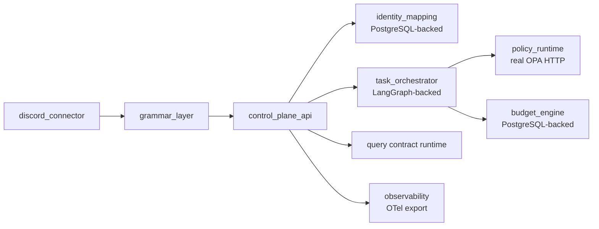

# OpenQilin v2 — Control Plane Component Delta

Extends `design/v1/components/ControlPlaneComponentDesign-v1.md`. Only changes are documented here; unchanged behavior inherits from v1.

## 1. Changes in v2

### 1.1 Security: Fix role self-assertion (C-6) — BREAKING
**Current (v1):** Actor role taken from `x-openqilin-actor-role` HTTP header; self-asserted, no cryptographic binding.
**v2:** Role is derived from the verified principal mapping in the identity repository, not from the request header. The header is ignored for role assignment.

```python
# principal_resolver.py — v2
async def resolve(self, external_identity: ExternalIdentity) -> PrincipalContext:
    mapping = await self.identity_repo.get_by_external_id(
        channel=external_identity.channel,
        actor_external_id=external_identity.actor_external_id,
    )
    if mapping is None or mapping.state != "verified":
        raise AuthorizationError("unknown_or_unverified_identity")
    return PrincipalContext(
        principal_id=mapping.principal_id,
        principal_role=mapping.role,   # ← from DB, not header
        trust_domain=mapping.trust_domain,
    )
```

### 1.2 Security: Fix `chat_class` KeyError (C-7)
**Current (v1):** `_MEMBERSHIP_BY_CHAT_CLASS[chat_class]` raises `KeyError` for unknown values → 500.
**v2:** Use `.get()` with a fail-closed default.

```python
# discord_governance.py — v2
allowed_members = _MEMBERSHIP_BY_CHAT_CLASS.get(chat_class)
if allowed_members is None:
    raise GovernanceDenialError(f"unknown_chat_class: {chat_class}")
```

### 1.3 Grammar layer: Intent classifier and command parser (M11)
New package: `src/openqilin/control_plane/grammar/`

| Module | Responsibility |
|---|---|
| `intent_classifier.py` | Classify inbound message into `discussion`, `query`, `mutation`, `admin` |
| `command_parser.py` | Parse compact command syntax `/oq <verb> [target] [args]` into structured `CommandEnvelope` |
| `free_text_router.py` | Resolve free-text routing target from chat class and project binding context |

The Discord bridge (`discord_runtime/bridge.py`) calls the grammar layer before building the ingress payload. A `mutation` classified from free text is rejected; an explicit `/oq` command bypasses the free-text classifier.

### 1.4 New v2 interaction endpoints

| Method | Endpoint | Purpose |
|---|---|---|
| `POST` | `/v1/owner/commands` | Unchanged from v1; now also accepts parsed compact command input |
| `POST` | `/v1/discord/ingress` | Unchanged from v1; now pre-processes through grammar layer |
| `GET`  | `/v1/system/health` | New: structured health check for Grafana panel polling |

### 1.5 Secretary activation (M11)
Secretary agent is wired as a real responder:
- Routed to for free-text in institutional shared channels when no explicit recipient is named
- Uses advisory-only policy profile: `allow` for `advisory` axis, `deny` for all others (per `AuthorityMatrix.yaml`)
- Responds with LLM-generated summaries, triage, and routing suggestions only; does not issue commands or mutate state

### 1.6 CSO activation (M12 — after OPA wiring)
CSO agent activated as a real advisory governance gate. Activation is gated: CSO MUST NOT be activated in `dependencies.py` until `OPAPolicyRuntimeClient` is wired (not `InMemoryPolicyRuntimeClient`). A startup check enforces this.

## 2. Updated Integration Topology



## 3. Failure Modes Added in v2

| Failure mode | Detection point | Response |
|---|---|---|
| Unknown `chat_class` | `discord_governance.py` | `governance_denial` (403), not 500 |
| Unverified/missing identity mapping | `principal_resolver.py` | `authorization_error` (403) |
| Grammar parse failure | `grammar_layer` | `validation_error` with actionable feedback |
| Free-text mutation attempt | `intent_classifier` | `validation_error`: "use explicit command syntax" |

## 4. Related References
- `spec/orchestration/communication/OwnerInteractionGrammar.md`
- `spec/orchestration/communication/OwnerInteractionModel.md`
- `spec/cross-cutting/security/IdentityAndAccessModel.md`
- `design/v1/components/ControlPlaneComponentDesign-v1.md`
- `design/v2/adr/ADR-0004-OPA-HTTP-Client-Integration.md`
