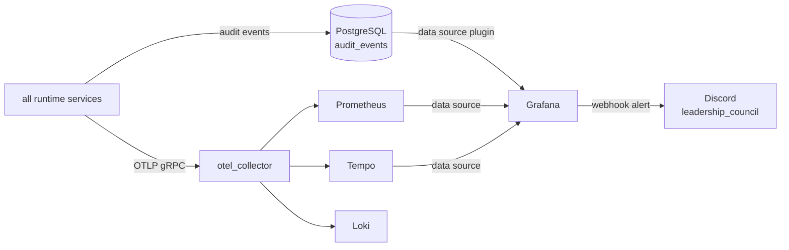

# OpenQilin v2 — Observability and Dashboard Component Delta

Extends `design/v1/components/ObservabilityComponentDesign-v1.md`. Only changes are documented here.

## 1. Changes in v2

### 1.1 Wire OTel export from all three observability modules (C-5)

All three modules currently store data in Python lists with no external sink. v2 replaces them with real OTel exporters.

**`src/openqilin/observability/audit/audit_writer.py`:**
```python
class OTelAuditWriter:
    """Writes audit events as OTel log records via OTLP exporter."""
    def __init__(self, otlp_endpoint: str):
        self._logger = logging.getLogger("openqilin.audit")
        # OTel log handler configured with OTLP log exporter

    async def write(self, event: AuditEvent) -> None:
        # Structured log record with all required AuditEvent fields
        self._logger.info(
            event.event_type,
            extra={
                "trace_id": event.trace_id,
                "principal_id": event.principal_id,
                "policy_version": event.policy_version,
                "policy_hash": event.policy_hash,
                "rule_ids": event.rule_ids,
                ...
            }
        )
        # Also persists to PostgreSQL audit_events table for Grafana queries
        await self._audit_repo.insert(event)
```

Audit events are written to BOTH OTel (for Grafana Loki/trace correlation) AND PostgreSQL (for Grafana business panel queries). The PostgreSQL write is the durable record; OTel is the streaming export.

**`src/openqilin/observability/tracing/tracer.py`:**
```python
from opentelemetry import trace
from opentelemetry.exporter.otlp.proto.grpc.trace_exporter import OTLPSpanExporter
from opentelemetry.sdk.trace import TracerProvider
from opentelemetry.sdk.trace.export import BatchSpanProcessor

def configure_tracer(otlp_endpoint: str) -> None:
    provider = TracerProvider()
    provider.add_span_processor(
        BatchSpanProcessor(OTLPSpanExporter(endpoint=otlp_endpoint))
    )
    trace.set_tracer_provider(provider)
```

**`src/openqilin/observability/metrics/recorder.py`:**
```python
from opentelemetry import metrics
from opentelemetry.exporter.otlp.proto.grpc.metric_exporter import OTLPMetricExporter
from opentelemetry.sdk.metrics import MeterProvider
from opentelemetry.sdk.metrics.export import PeriodicExportingMetricReader

def configure_metrics(otlp_endpoint: str) -> None:
    reader = PeriodicExportingMetricReader(OTLPMetricExporter(endpoint=otlp_endpoint))
    metrics.set_meter_provider(MeterProvider(metric_readers=[reader]))
```

### 1.2 Grafana dashboard provisioning

See `design/v2/adr/ADR-0007-Grafana-Single-Dashboard-Strategy.md`.

New directory: `ops/grafana/`
```
ops/grafana/
  provisioning/
    datasources/
      postgresql.yaml
      prometheus.yaml
      tempo.yaml
    dashboards/
      dashboard.yaml
    alerting/
      contact_points.yaml    ← Discord webhook contact point
      notification_policy.yaml
      rules.yaml             ← threshold alert rules
  dashboards/
    operator-main.json       ← provisioned dashboard definition
```

`compose.yml` Grafana service gains volume mounts for the provisioning directory.

### 1.3 LangSmith optional tracing layer (M11)

LangGraph emits traces to LangSmith automatically when env vars are set. No code change required; add to `compose.yml`:
```yaml
orchestrator_worker:
  environment:
    LANGCHAIN_TRACING_V2: ${LANGCHAIN_TRACING_V2:-false}
    LANGCHAIN_API_KEY: ${LANGCHAIN_API_KEY:-}
    LANGCHAIN_PROJECT: ${LANGCHAIN_PROJECT:-openqilin-dev}
```

LangSmith is not wired to the internal audit trail and is not a governance audit source.

## 2. Updated Integration Topology



## 3. Failure Modes

| Failure mode | v2 behavior |
|---|---|
| OTel collector unreachable | Log locally and continue; governance-critical events also written to PostgreSQL (durable) |
| PostgreSQL audit write failure | Propagate error; fail task; do not silently proceed without audit record |
| Grafana unreachable | No impact on runtime; operator loses dashboard visibility only |
| Discord webhook failure | Grafana retries; alert eventually delivered |

## 4. Testing Focus
- Audit writer: assert OTel span and PostgreSQL row both created for governance-critical action
- OTel fail-safe: assert runtime continues when collector is down (after PostgreSQL write succeeds)
- Grafana datasource: smoke test that Owner Inbox panel returns non-empty results after test data insertion
- Alert routing: assert Grafana alert fires and reaches Discord webhook on threshold breach

## 5. Related References
- `design/v2/adr/ADR-0007-Grafana-Single-Dashboard-Strategy.md`
- `spec/observability/OperatorDashboardModel.md`
- `spec/observability/AuditEvents.md` (AUD-001)
- `spec/observability/ObservabilityArchitecture.md`
