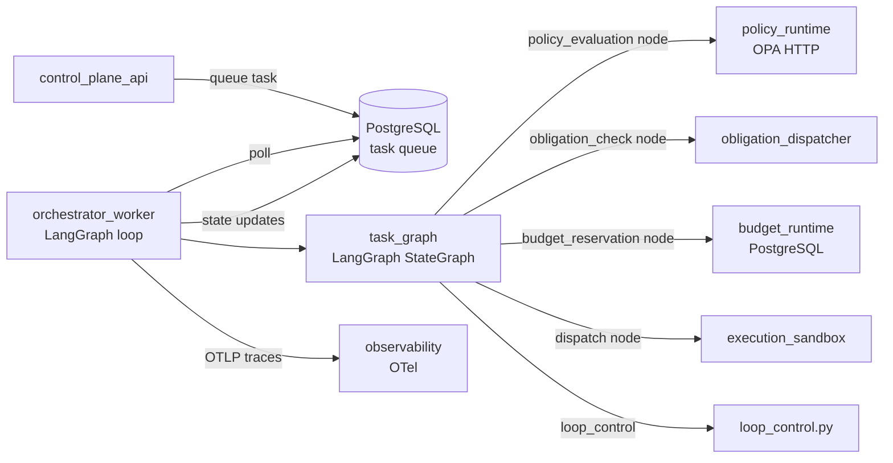
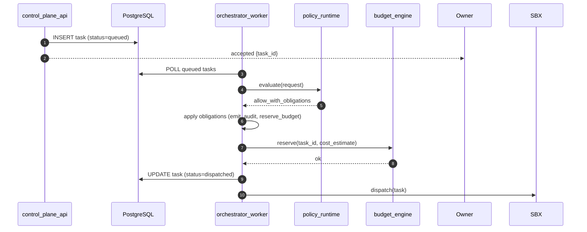

# OpenQilin v2 — Task Orchestrator Component Delta

Extends `design/v1/components/TaskOrchestratorComponentDesign-v1.md`. Only changes are documented here.

## 1. Changes in v2

### 1.1 LangGraph state machine replaces linear call chain
See `design/v2/adr/ADR-0005-LangGraph-State-Machine-Adoption.md`.

The `orchestrator_worker` process becomes a real async loop. The HTTP command handler becomes admission-only.

**New package structure additions:**
```
src/openqilin/task_orchestrator/
  workflow/
    graph.py          ← LangGraph StateGraph definition (was placeholder)
    nodes.py          ← node functions (policy_gate, obligation_gate, budget_gate, dispatch)
    state_models.py   ← TaskState TypedDict for LangGraph
  state/
    state_machine.py  ← LangGraph graph compilation and transition enforcement (was placeholder)
    transition_guard.py ← validates legal transitions per TaskStateMachine spec
  loop_control.py     ← hop count and pair-round tracking per trace
```

### 1.2 Task status transition guard (H-2)

`transition_guard.py` enforces legal transitions from `spec/state-machines/TaskStateMachine.md`:

```python
LEGAL_TRANSITIONS = {
    "queued": {"policy_evaluation"},
    "policy_evaluation": {"obligation_check", "blocked"},
    "obligation_check": {"budget_reservation", "blocked"},
    "budget_reservation": {"dispatched", "blocked"},
    "dispatched": {"running", "failed"},
    "running": {"completed", "failed", "blocked"},
    "blocked": {"queued"},  # re-queued after owner unblock
    "completed": set(),
    "failed": set(),
    "cancelled": set(),
}

def assert_legal_transition(current: str, next_state: str) -> None:
    if next_state not in LEGAL_TRANSITIONS.get(current, set()):
        raise InvalidStateTransitionError(current, next_state)
```

### 1.3 Fix fail-open dispatch fallback (H-1)

`task_service.py` fallback arm changed from silent success to fail-closed:

```python
# v2
else:
    raise DispatchTargetError(f"unknown dispatch target: {target}")
    # Task transitions to `failed`, not `dispatched`
```

### 1.4 Loop controls enforcement

`loop_control.py` tracks per-trace state in `TaskState`:

```python
@dataclass
class LoopState:
    hop_count: int = 0
    pair_rounds: dict[tuple[str, str], int] = field(default_factory=dict)

def check_and_increment_hop(state: LoopState, limit: int = 5) -> None:
    state.hop_count += 1
    if state.hop_count > limit:
        raise LoopCapBreachError("hop_count", state.hop_count)

def check_and_increment_pair(state: LoopState, sender: str, recipient: str, limit: int = 2) -> None:
    pair = (sender, recipient)
    state.pair_rounds[pair] = state.pair_rounds.get(pair, 0) + 1
    if state.pair_rounds[pair] > limit:
        raise LoopCapBreachError("pair_rounds", state.pair_rounds[pair])
```

On `LoopCapBreachError`: emit audit event → transition task to `blocked` → notify owner.

### 1.5 Orchestrator worker becomes a real processing loop

```python
# apps/orchestrator_worker.py — v2
async def run():
    task_graph = build_task_graph()
    async for task in task_queue.subscribe():
        async with db_session() as session:
            try:
                result = await task_graph.ainvoke({"task_id": task.id})
                await update_task_status(session, task.id, result.final_state)
            except Exception as e:
                await update_task_status(session, task.id, "failed", reason=str(e))
```

### 1.6 Fix snapshot split-brain (H-3)

`runtime_state.py` flush must be atomic with in-memory mutation:

```python
async def update_task_status(self, task_id: str, status: str) -> None:
    assert_legal_transition(self._tasks[task_id].status, status)  # guard first
    # For PostgreSQL-backed v2: write to DB (durable), then update local cache
    await self._pg_repo.update_status(task_id, status)
    self._tasks[task_id].status = status  # cache update after durable write
```

## 2. Updated Integration Topology



## 3. Sequence: Task Admission to Dispatch (v2)



## 4. Failure Modes Added in v2

| Failure mode | v2 behavior |
|---|---|
| Invalid state transition | `InvalidStateTransitionError` → task `failed` + audit event |
| Unknown dispatch target | `DispatchTargetError` → task `failed` (not silently `dispatched`) |
| Loop cap breach | `LoopCapBreachError` → task `blocked` + owner notification + audit event |
| OPA fail-closed | Deny → task `blocked` |

## 5. Testing Focus
- Legal state transition: assert invalid transitions raise errors
- Fail-closed dispatch: assert unknown target produces `failed`, not `dispatched`
- Loop cap: assert trace blocked after hop limit; audit event emitted
- Worker processing: end-to-end test from `queued` task to `completed` through real LangGraph graph

## 6. Related References
- `design/v2/adr/ADR-0005-LangGraph-State-Machine-Adoption.md`
- `spec/orchestration/control/TaskOrchestrator.md`
- `spec/state-machines/TaskStateMachine.md`
- `spec/orchestration/communication/AgentLoopControls.md`
