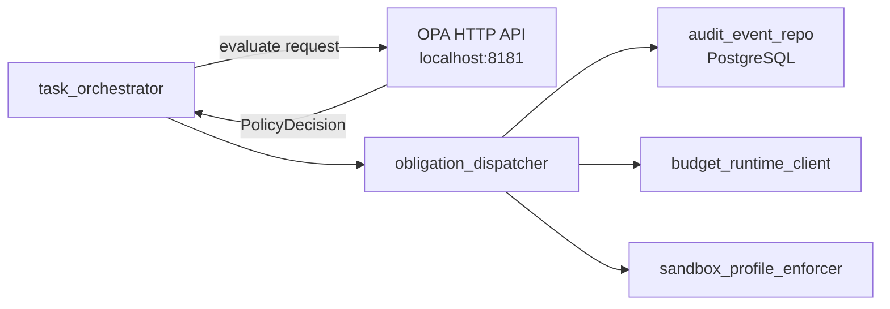

# OpenQilin v2 — Policy Runtime Component Delta

Extends `design/v1/components/PolicyRuntimeIntegrationDesign-v1.md`. Only changes are documented here.

## 1. Changes in v2

### 1.1 Replace `InMemoryPolicyRuntimeClient` with `OPAPolicyRuntimeClient`

See `design/v2/adr/ADR-0004-OPA-HTTP-Client-Integration.md` for the full decision.

**Target:** `src/openqilin/policy_runtime_integration/client.py`

```python
class OPAPolicyRuntimeClient:
    """
    Sends policy evaluation requests to OPA's REST API.
    Fail-closed: any error (network, timeout, non-200) returns deny with POL-003.
    """
    async def evaluate(self, request: PolicyRequest) -> PolicyDecision:
        try:
            response = await self._http.post(
                f"{self._opa_url}/v1/data/openqilin/policy/decide",
                json=request.model_dump(),
                timeout=self._timeout_ms / 1000,
            )
            response.raise_for_status()
            return PolicyDecision.model_validate(response.json())
        except Exception:
            return PolicyDecision(decision="deny", rule_ids=["POL-003"], obligations=[])
```

`InMemoryPolicyRuntimeClient` is moved to `src/openqilin/policy_runtime_integration/testing/in_memory_client.py` and used only in test environments.

### 1.2 Implement obligation application

**Target:** `src/openqilin/policy_runtime_integration/obligations.py`

Currently an empty placeholder. v2 implementation:

```python
OBLIGATION_ORDER = [
    "emit_audit_event",
    "require_owner_approval",
    "reserve_budget",
    "enforce_sandbox_profile",
]

class ObligationDispatcher:
    async def apply(
        self,
        obligations: list[str],
        context: ObligationContext,
    ) -> ObligationResult:
        for obligation in OBLIGATION_ORDER:
            if obligation not in obligations:
                continue
            result = await self._dispatch(obligation, context)
            if not result.satisfied:
                return ObligationResult(
                    satisfied=False,
                    blocking_obligation=obligation,
                    reason=result.reason,
                )
        return ObligationResult(satisfied=True)
```

Each obligation has a dedicated handler:
- `emit_audit_event`: writes to `PostgresAuditEventRepository` (mandatory for all decisions)
- `require_owner_approval`: transitions task to `blocked` with `approval_required` reason, notifies owner
- `reserve_budget`: calls `BudgetRuntimeClient.reserve()`; fails closed if uncertain
- `enforce_sandbox_profile`: validates and binds the dispatch target's sandbox profile

### 1.3 OPA Rego policy bundle

New directory: `src/openqilin/policy_runtime_integration/rego/`

| File | Content |
|---|---|
| `policy.rego` | Rego package implementing all 12 rules from `constitution/core/PolicyRules.yaml` |
| `data/authority_matrix.json` | Generated from `constitution/core/AuthorityMatrix.yaml` at build time |
| `data/obligation_policy.json` | Generated from `constitution/core/ObligationPolicy.yaml` at build time |

OPA loads the bundle via the `--bundle` flag in the OPA container entrypoint:
```yaml
# compose.yml
opa:
  image: openpolicyagent/opa:latest
  command: ["run", "--server", "--bundle", "/bundle"]
  volumes:
    - ./src/openqilin/policy_runtime_integration/rego:/bundle
```

### 1.4 Constitution bundle verification at startup

`src/openqilin/shared_kernel/startup_validation.py` must add:
```python
async def verify_opa_bundle_loaded(opa_client: OPAPolicyRuntimeClient) -> None:
    """Verify OPA is reachable and the constitution bundle is active."""
    health = await opa_client.health_check()
    if not health.ok:
        raise RuntimeError("OPA is not reachable; refusing to start")
    version = await opa_client.get_active_policy_version()
    if version != settings.expected_constitution_version:
        raise RuntimeError(f"OPA bundle version mismatch: {version}")
```

## 2. Updated Integration Topology



## 3. Failure Modes

| Failure mode | Response |
|---|---|
| OPA unreachable (startup) | Refuse to start; block traffic |
| OPA unreachable (runtime) | Fail closed: return deny with `POL-003` |
| OPA timeout (>150ms) | Fail closed: return deny with `POL-003` |
| Bundle version mismatch | Fail closed: refuse startup |
| Obligation handler failure | Transition task to `blocked`; emit audit event |

## 4. Testing Focus
- Rego policy evaluation: unit-test each rule against the authority matrix
- OPA fail-closed: assert `deny` when OPA returns 500 or times out
- Obligation order: assert `emit_audit_event` fires before other obligations
- `require_owner_approval` transitions task to `blocked` and notifies owner

## 5. Related References
- `design/v2/adr/ADR-0004-OPA-HTTP-Client-Integration.md`
- `spec/constitution/PolicyEngineContract.md`
- `constitution/core/PolicyRules.yaml`
- `constitution/core/AuthorityMatrix.yaml`
- `constitution/core/ObligationPolicy.yaml`
